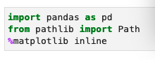
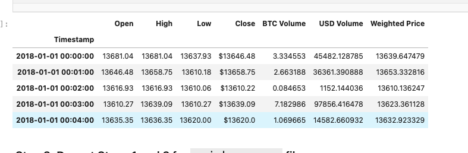
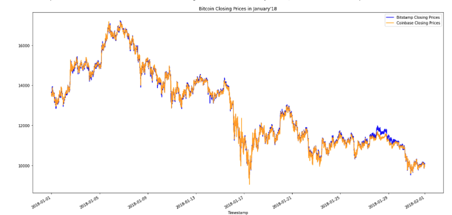

# Week-3-Challange-Arbitrage
 ---
 ## Cryptocurrencies and Arbitrage Opportunities
 
 

     
    Cryptocurrencies like Bitcoin are now ubiquitously traded via different platforms like Coinbase, Gemini, Binance, Robinhood, Bitfinex, etc. Acceptance of cryptocurrencies has led to a surge of interest and buying and selling of these digital assets. While the high efficient technology has allowed user to quickly buy and sell these assets, the price discrepancies in these assets still exist. The high-speed algorithms and bots are efficient to discover any existing gaps, thus creating an arbitrage situation, buying at a lower rate and selling at a higher price. 

    
    

 ## About the application ##

   The application attempts to evaluate the opprotunity at making an successful arbitrage in the Bitcoin market. There are two exchange platforms: Bitstamp and Coinbase. A close look shows that the prices in bewteen two different crypto exchnage platforms have discrepancies.  
    The application takes a close look at history of prices in between January and March of 2018. By close obeservations, as well as visual ques, we try to estimate, if there is a viable opportunity of arbitage.
    
  ---
## Technology
    
* The application was written using Jupyterlab (3.2.1) and is written in accordance to Python format and syntax.  
* We import libraries such as Pandas which allows us to explore, edit, and analyze the vast amount of data.
*We use matplotlib to allow illustration of the data.
  
    
---    
    
**To install the necessary libraries and functions**
    
 

    
---
    
**Usage:**
    
The program is useful for user to evaluate different parts of the arbitration process:
    
   * It enables the user to see the elaborate data in a tubular form. Using, the Timestamp as reference points, the application enables the user to see the trading oprning, closinh, highs- lows, market weightage, etc.
    
    
    

    
  * The application also enables the user to use graphical means to get an deeper insight into the data. For instance, we can see two linear graphs showing prices of Bitcoin on the different platforms.
    
    

    
    
  * The application can also show statistical figures like Mean, Standard Deviations, etc.
    
    

    
  * Finally, the application allows the user to estimate arbitrage profits and numbers
    
    
 
    
    
---
    
    
**Contribution: Babin Shrestha**
 
    
    
    
    